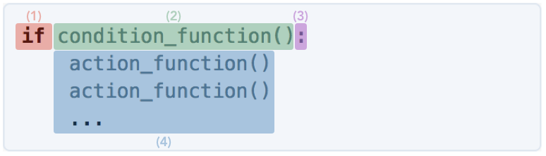
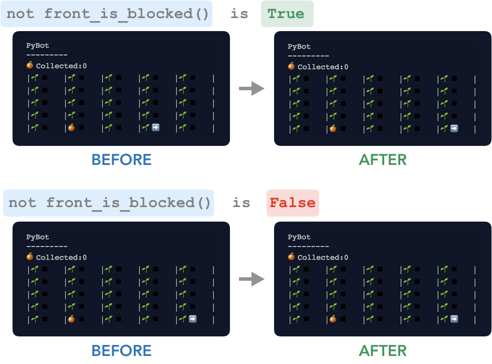
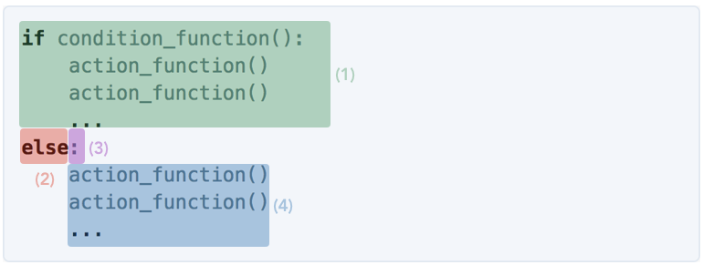
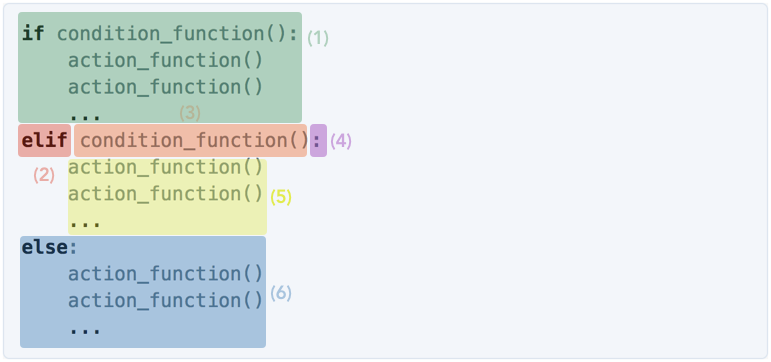
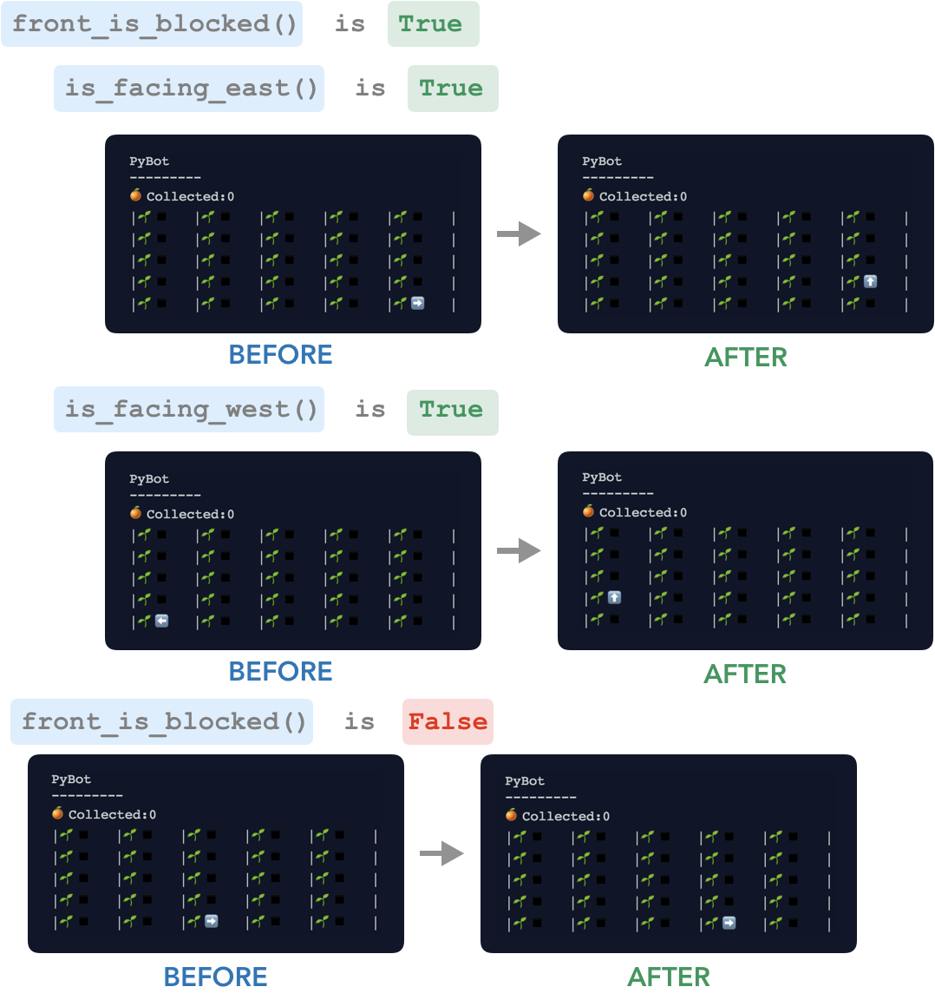

We've learned how to instruct PyBot to take actions using functions like `move()`, `turn_right()`, and `pick_fruit()`. We've also learned how to combine these functions together to create our own functions – for example, we combined three `turn_right()` calls into one function called `turn_left()`. 

But up until now, we've only been giving PyBot a list of actions to take. Everytime we run a particular program, PyBot does the exact same thing. Things get interesting when PyBot can start making decisions on her own!

--- 

Consider the following scenario: You are about to go to the grocery store. You ask your friend if she needs anything from the store, to which she responds: "If they have any Maracuja, get me some, please." 

Notice how your friend used a conditional instruction: **if** they have Maracuja, then you should buy her some Maracuja. Otherwise, you should buy nothing for her. 

When programming PyBot, we sometimes need to give her conditional instructions. 

<div class="example-section" markdown="1">

<span class="example-title">Example</span>
For example, we might want to tell her: "If there is an orange in your cell, pick the orange." Using a conditional instruction is important here because PyBot will crash if she attempts to pick an orange in a cell where there is no orange. How do we do this in Python? We can program the conditional instruction, "if your current cell has a fruit, pick the fruit", using an `if` statement like this: 

_Python Code_
```python
if has_fruit(): 
    pick_fruit()
```

The code above will instruct PyBot to check if there is an orange in her cell, and then, if there is, to pick it. 
</div>

Let's explore `if` statements in more detail. 

<a class="anchor-offset" id="if-statements" href="#if-statements"></a>

# Conditional Instruction: `if` 
In Python, we program conditional instruction using `if` statements. 

> `if` **Statement** – A section of code that should only be executed if a condition is `True`. 

Every `if` statement consists of  a condition (i.e. a _True_ or _False_ question, like the ones we can ask PyBot with the condition functions) and **indented** code to be executed if the condition is satisfied (i.e. the answer to the question is _True_). 

<div class="definition-section" markdown="1">

<span class="definition-title">Definition</span>
**Indent** - The space that pushes the code to the right on the line.

</div>

Let's learn the steps for writing `if` statements with PyBot:

1. First, we start with the word `if` followed by a space .
2. Next, we write a PyBot condition function (e.g. `has_fruit()`, `front_is_blocked()`). Remember, using a PyBot conditions function is like asking a True or False question to PyBot.
3. We put a colon (i.e. `:`) after the condition.
4. Lastly, we write the code that PyBot should follow if the answer to the condition function is `True`. These instructions should be written under the condition function and should be indented in **one tab** relative to the word `if`. These instructions can be a list of action functions or, as we'll see later, other conditional statements and loops. 

In a way, `if` statements grant your program _decision making power_. With an `if` statement, your program will decide what to do based off a condition. 

<a class="anchor-offset" id="inverting" href="#inverting"></a>

## Inverting Conditions: `not`
Here's another `if` statement example with PyBot. We want to program PyBot to move if she is not on the edge of the field, so that she won't ever crash.

We need to program the conditional instruction: "`if` the front is clear, move." PyBot can answer the question "is the front blocked?" with the `front_is_blocked()` function, but she cannot directly answer "is the front clear?" We only have the opposite of the condition we need to check. How can we program this conditional instruction?

Luckily, Python provides the keyword `not` which inverts any condition. For example, `not front_is_blocked()` asks the question "Is the front not blocked?" (i.e. is the front clear). Let's write the `if` statement for the conditional instruction: 

_English Conditional Instruction_
> `if` the front is clear, move

_Python Code_
```python
if not front_is_blocked():
    move()
```

_Result_


In summary, `not` allows us to write `if` statements where code is executed if a condition is **not** true.

<a class="anchor-offset" id="else-elif" href="#else-elif"></a>

## Default Instruction: `else`
Let's return for a moment to the scenario from before: You are going to the grocery store. You ask your friend if she needs anything, except this time she responds "If they have any maracuja, get me some, otherwise get me mango." 

In this example, your friend has given you a conditional instruction with **2** possible courses of action: `if` there is Maracuja then you should (1) get her maracuja, `else` you should (2) get her mango. Here, the second option is the default course of action – that is the action that should be taken if the condition is `False`.

In Python, we can program conditional instructions to have a default course of action by extending the `if` statement with an `else` statement. 

Let's walk through the steps of writing an _if-else_ statement:
 
 

1. First, we write a regular `if` statement with a condition and conditional instructions. 
2. Next, we write `else` at the same level of indentation as `if` above.
3. We follow the `else` with a colon
4. And finally, we write the instructions to be followed if the condition was `False`. 

In summary, with `else`, the computer will follow a default course of action if the condition in the `if` statement is `False`. 

<div class="example-section" markdown="1">

<span class="example-title">Example</span> 
As an example, consider the following conditional instruction:
_Conditional Instruction in English_ 
> **If** there is a fruit in the current cell pick it up, **else** move forward. 

To code this conditional instruction in Python, we can use an if-else statement: 

_Python Code_
```python
if has_fruit():
    pick_fruit()
else: 
    move()
```
</div>

## Conditional Instruction: `elif`
Let's go back to  to the grocery store example one last time: You are about to go to the grocery store. You ask your friend if she needs anything from the store, to which she responds: "If they have any Maracuja, get me a Maracuja. Else, if they have Kiwis, get some of those. Otherwise, just get me Mango". 

At the grocery store you will follow one of **three** possible courses of action: (1) buy Maracuja, (2) buy Kiwi or (3) buy Mango. In Python, we can program conditional instructions with multiple possible courses of action by extending the `if` statement with an `elif` statement. 

 

1. First, we have a regular `if` statement with a condition and code. 
2. Next, we write `elif` at the same level of indentation as `if` above.
3. We follow `elif` with a second condition to be evaluated if the first one is `False`. 
4. We include a colon
5.  we write the default instructions to be followed in the case that the condition above the `else` was `False`. 
6. (Optional) We add a default action 

Note that the order of elif is very important. 

<div class="example-section" markdown="1">

<span class="example-title">Example</span>
Let's take a look at a PyBot example that uses `elif`. Our task here is to turn PyBot so that she faces south. 

Let's start by writing out the conditional instruction in English. 

_Conditional Instruction in English_ 
>**If** PyBot is facing east, she should turn right once,  **else if** she is facing north, she should turn right twice, **else if** she is facing west, she should turn right thrice, **else** she should do nothing, since she was already facing south. 

_Python Code_ 
```python
if is_facing_east():
    turn_right()

elif is_facing_north():
    turn_right()
    turn_right()

elif is_facing_west():
    turn_right()
    turn_right()
    turn_right()
```
</div>

<a class="anchor-offset" id="nesting" href="#nesting"></a>

## Nesting Conditional Statements  

Back to the grocery store example: You are headed to the grocery store, but this time you're not sure if it is open. Your friend says, "If the grocery store is open, go inside. If they have Maracuja, get me some, otherwise get me Mango. If the grocery store is closed, just go to the pharmacy." 

In this case, your friend gave you a conditional instruction that had another conditional instruction inside it. This is called a **nested conditional instruction**. 

In Python, we can program nested conditional instructions by simply putting `if` statements inside other `if` statements. 

```python
if condition_function():
    if condition_function(): 
        action_function()
        action_function()
        ...
    action_function()
    action_function()
    ...
``` 
<div class="example-section" markdown="1">

<span class="example-title">Example</span>
Let's do a PyBot example that uses a nested conditional. Imagine PyBot is on the bottom row of the field. We are going to program PyBot to move into a new cell. It won't suffice to simply use move(), since PyBot will crash if she is facing a wall. Instead, if PyBot if the front is blocked, we'll turn PyBot to face north and move to the second row.

_Python Code_
```python
if front_is_blocked():
    if is_facing_east(): 
        turn_right()
        turn_right()
        turn_right()
    elif is_facing_west(): 
        turn_right()
move()
```

_Result_

 

</div>


<a class="anchor-offset" id="combining-conditions" href="#combining-conditions"></a>

## Logical Operators – Compound Conditions

### Logical Operator: and 
You are headed to the grocery store and your friend says, "I want to make mango sticky rice. If they have mango and they have sticky rice, buy me mango and buy me some rice. Otherwise, buy me nothing." 

Here, your friend gave you a compound conditional instruction using the word **and**. Similarly, we can build compound conditional in Python using the keyword `and`:

``` python 
    condition_function_1() and condition_function_2()
```

The compound condition is `True`, when both conditions are `True`.

We can use a compound conditional in `if` statements like this:

```python
if condition_function_1() and condition_function_2():
    action_function()
    action_function()
    ...
```
 
<div class="example-section" markdown="1">

<span class="example-title">Example</span>
The northern side of PyBot's field is colder, so she doesn't like to spend much time up there. Let's program PyBot to move down from Imagine that PyBot Let's program PyBot with the following conditional instruction: if PyBot is on the top row and she's facing north, turnaround and move down one row. 

``` python
if front_is_blocked() and is_facing_north():
    turn_right()
    turn_right()
    move()
```
</div>


### Logical Operator: or 
Let's consider the grocery store example one last time: You are going to the grocery store and your friend says, "If they have either white rice or brown rice, buy me some." 

Here your friend used a compound conditional instruction with the word **or**. Like `and` above, Python has the keyword `or` for programming compound conditional instructions. 

``` python 
    condition_function_1() and condition_function_2()
```

The compound condition is `True`, when either of the conditions are `True`.

We can use a compound conditional in `if` statements like this:

```python
if condition_function_1() or condition_function_2():
    action_function()
    action_function()
    ...
