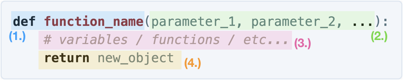

Welcome to Part 2 of Advanced Functions! The last section of notes described how objects relate to functions. As quick review:

<a class="anchor-offset" id="review" href="#review"></a>
### Review: Parameter Passing

Some functions require more information in order to do what they are supposed to do. We can _pass_ this information into functions using objects. 

For example, the function `print` and the function `range`. The function `print` needed to know what to print, so we put a `string` object in between the parentheses. The function `range` needed to know how many iterations were necessary for a `for` loop, so we put an `int` object in between the parentheses. The functionality of these two functions changed based on the information we gave the two functions.

```python
# prints "Hi!" 5 times.
for i in range(5):
    print("Hi!")

# prints "Hello!" 3 times.
for i in range(3):
    print("Hello!")
```

### Review: Returning Values

Some functions are capable of creating objects in order to communicate back to the function that called it. This process is called _returning_ an object. When you call a function, imagine that it goes somewhere else, executes some code, creates an object, then returns that object back to you.

For example, last week we learned about `capitalize_string`. 

```python
message = "I love python"
capitalized_message = capitalize_string(message)
print(message)             # prints "I love python"
print(capitalized_message) # prints "I LOVE PYTHON"
```

This function capitalized all of the letters in a phrase. This function needed more information, specifically the phrase it needed to capitalized. So, we had to put a `string` object in between its parentheses. We _passed_ a `string` parameter into the function.

The function called `capitalize_string` looked at this `string` object, then executed some code to create a new `string` object. The new `string` object created by the function is the object with all of its letters capitalized. In order to use the object created by `capitalize_string`, we must label it. If we place a variable to the left of `capitalize_string`, this variable will label the object created by `capitalize_string`. If we do not label the object created by `capitalize_string`, we will lose the object forever.

Using objects to communicate back and forth between functions is incredibly powerful. This week you will learn how to define functions that can do this. By the end of this week, you will be writing functions capable of interacting with objects.

<a class="anchor-offset" id="defining-functions" href="#defining-functions"></a>
### Defining Functions

Here, we will be revisiting an old exercise: Theorem of Pythagoras. One way to write this program is by writing a program that looks like this:

```python
import input_float, square_root

def main():
    a = input_float("Enter a value for side a:")
    b = input_float("Enter a value for side b:")
    c_squared = a * a + b * b
    c = square_root(c_squared)
    print(c)
```

However, all of this code is in `main`! The first lesson of this course was to write functions to make our code short, easy to read, and easy to fix. It would be better if we had a program that looked like this:

```python
import input_float, square_root

def main():
    a = input_float("Enter a value for side a:")
    b = input_float("Enter a value for side b:")
    c = solve_pythagorean_theorem(a, b)
    print(c)
```

As it turns out, we can write code that looks like this! We would simply have to add the following function:

```python
def solve_pythagorean_theorem(a, b):
    temp = a * a + b * b
    c = square_root(temp)
    return c
```

With this piece of code, the complete program would look like this:

```python
import input_float, square_root

def solve_pythagorean_theorem(a, b):
    temp = a * a + b * b
    c = square_root(temp)
    return c

def main():
    side_a = input_float("Enter a value for side a:")
    side_b = input_float("Enter a value for side b:")
    c = solve_pythagorean_theorem(side_a, side_b)
    print(c)
```

Notice what we have done here. We have _defined_ a function capable of receiving objects. The function is also capable of creating an object and giving it back to the user. Knowing how to write functions capable of communicating via objects will allow us to build powerful, organized projects that handle large amounts of information.

Let's break down the syntax required to write these new functions.

<a class="anchor-offset" id="syntax" href="#syntax"></a>
### Syntax: Defining Functions

This is the complete syntax involved with defining new functions:



1. The same thing you had before. The `def` keyword followed by the function name.
2. The parameters (objects) your function needs! You can put as many parameters as you want between the parentheses.
3. The function body. Here it is represented by a comment, but you can any code in this section. Most interestingly, you can use the parameters you have included in your function definition.
4. The `return` keyword. Remember how we explained that functions could create new objects and "return" to the calling function with this object? Here is where you can select the object that you would like to return! Typically you create this object in the function body.

Remember that passing parameters and returning values is totally optional! You can have functions that only pass parameters, functions that only return values, or functions that do neither (like `move()` or `turn_right()`). It is your choice! With practice and experience, you will begin to see what kind of features your functions will need as you write more and more powerful programs.

### Syntax: Calling Functions

When you want to call your newly defined functions, the most important thing to remember is to pass in the _right number_ of parameters in the _correct order_. If you do this incorrectly, your program will crash or worse, it will run but mix up the values you have passed in. That said, the variable names placed in the function definition does not need to match the variable names used when calling the function. In fact, you don't need to use variables at all! The function definition creates variables in order to label the objects you have passed in. Take the following program for example:

```python
def create_email(username):
    result = username + "@gmail.com"
    return result

def main():
    email_1 = create_email("gdlangus")
    email_2 = create_email("eyuboglu")
    print(email_1) # prints "gdlangus@gmail.com"
    print(email_2) # prints "eyuboglu@gmail.com"
```

When we called `create_email` function the first time, the `username` variable was assigned to the string object `"gdlangus"`. When we called the `create_email` function the second time, the `username` variable was assigned to the string object `"eyuboglu"`. The function, when executing its function body, will create variables for each of the parameters passed in when the function is called.

Finally, we want to make sure that we are receiving the objects _returned_ by the functions we have defined. Like before, we can receive these objects by creating variables and setting them equal to the function itself. Remember that these are new objects, created from within the function body of the function you have defined.

<a class="anchor-offset" id="examples" href="#examples"></a>
### More Examples

Of course, as we have said in lecture, this is the kind of stuff that is best learned through the analysis of many, many examples. Below we have included more examples of little programs that use functions! Feel free to copy and paste them into Repl.it to try them out for yourself!

Here is a program that extends _Guest List_. This program not only collects guest names, but also ticket types for each of the guest's based on their age.

```python
def check_ticket_type(age):
    if age < 18:
        return "child"
    elif age >= 65:
        return "senior"
    else:
        return "adult"

def main():
    num_guests = input_int("How many guests?")
    for i in range(num_guests):
        guest_name = input_string("Enter guest name:")
        guest_age = input_int("Enter guest age:")

        ticket_type = check_ticket_type(guest_age)
        print(guest_name + ": " + ticket_type)
```

This program converts temperatures from Celsius to Fahrenheit! Useful for international travelers.

```python
def convert_celsius_to_fahrenheit(degrees_celsius):
    degrees_fahrenheit = degrees_celsius * 1.8 + 32
    return degrees_fahrenheit

def main():
    current_temp = input_int("Enter the temperature in Celsius:")
    converted_temp = convert_celsius_to_fahrenheit(current_temp)
    print("The temperature in Fahrenheit is " + str(converted_temp))

```


