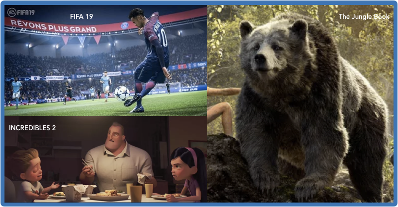

# Computer Science in Cinema and Video Games

We've been getting a lot questions about how the material we're learning in this class can be applied to real world problems. People seem particularly interested in **computer graphics**, which actually makes sense because many of us interact with computer graphics every day.

If you're wondering what Fifa 19 


```python
while True:
  
```
