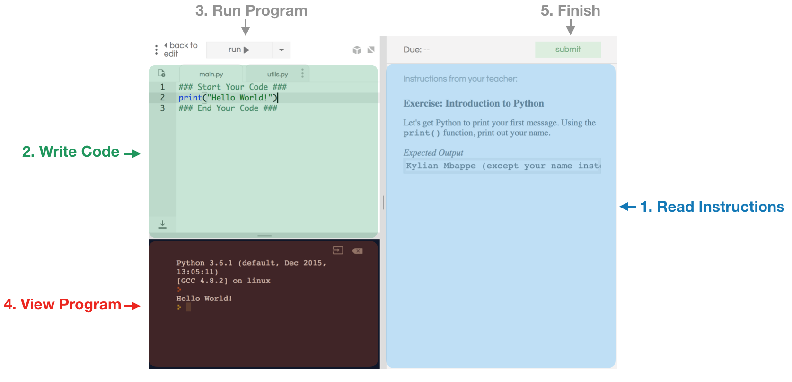

In this course we'll be working with a programming lanugage called Python. We chose Python because it is powerful, fun to work with and extremely popular. That being said, this is an introductory course in Computer Science, not Python – the ideas and concepts we cover can be applied to programming in almost any language. 

<a class="anchor-offset" id="replit" href="#replit"></a>
### Coding with repl.it
We are going to use a website called [repl.it](repl.it) that allows us to code in Python online. All of our exercises and assignments will be on repl.it. Below we explain how to use repl.it to write Python code: 



1. **Read Instructions** – For each exercise in repl.it, we'll include instructions in the right panel (highlighted in blue above). The instructions will tell how to complete the exercise. 
2. **Write Code** – Once you've read the instructions, you'll want to start writing code. You will write your code in the top left (highlighted in green above). 
3. **Start Program** – After writing some code, you'll want to try running your program. To run the program click the `run` button above the coding area. 
4. **View Program** – The program will appear in the black area (highlighted in red above). 
5. **Finish** – When you've finished your program and its working as you'd like, you'll need to submit the exercise. To do so, click the submit button in the top right. Clicking submit 

<a class="anchor-offset" id="first-program" href="#first-program"></a>
### Our First Python Program 
Let's write our first Python program. Our program will  only do one thing: show a simple message `I am a Python program!`

To print text in Python, we can use the `print()` function. In the parantheses following `print`, we write the message we'd like to print. For example: `print("Hello!")`. Notice that the message itself needs be written within quotation marks.

Let's write a program to print the message from above: `I am a Python program`. 

_Python Code_
```python
print("I am a Python program!")
```
_Result_
```
> I am a Python program!
```

Let's try using `print()` in the following exercise: 
 
 <a class="anchor-offset" id="exc-intro-python" href="#exc-intro-python"></a>
#### Exercise:  
<iframe frameborder="0" width="100%" height="600px" src="https://repl.it/student_embed/assignment/1211151/65629c184c91c55555e68086ece937d5"></iframe>