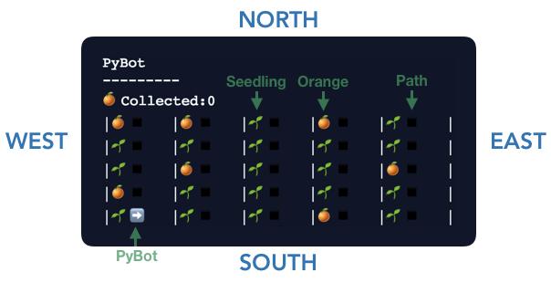
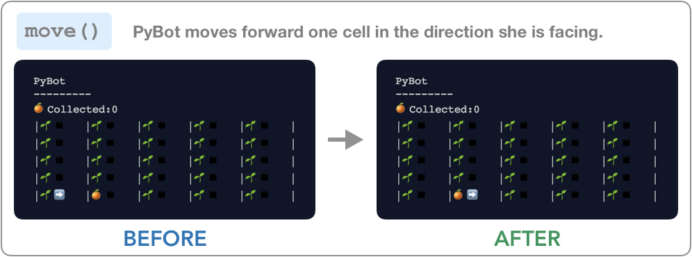
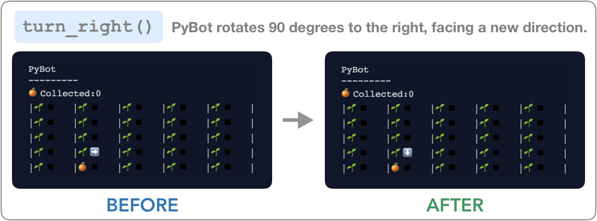
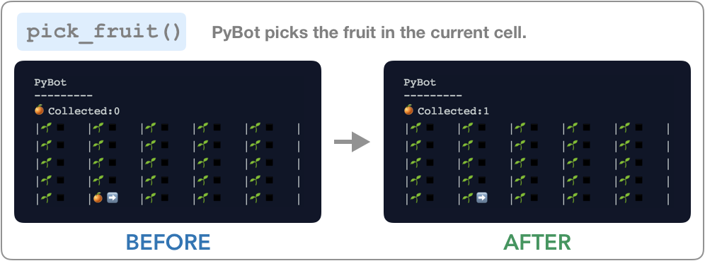
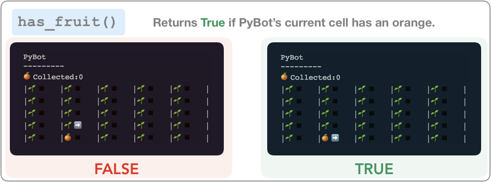
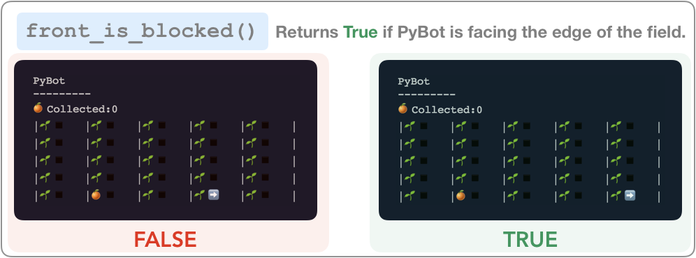
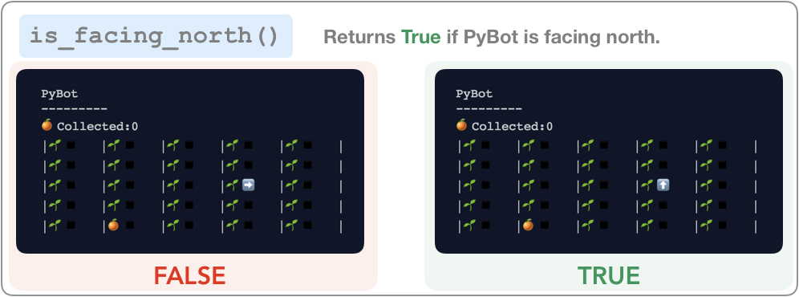
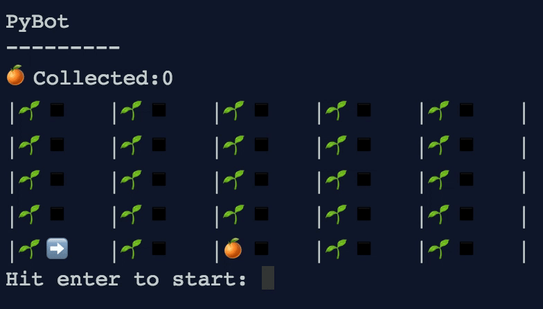

<a class="anchor-offset" id="intro-pybot" href="#intro-pybot"></a>
# Introducing PyBot and PyCountry
For the first week of the course, we're going to be working with a virtual robot name `PyBot`. We'll teach you some important Python concepts, and you will use those concepts to program PyBot to complete some tasks. (PyBot is based very closely on Karel the Robot, a virtual robot that students work with in Stanford's introductory computer science course.)

This is PyBot: ➡️. She is a simple robot that lives in PyCountry, a land renown for its oranges (it said that an orange from PyCountry is easier to peel than any orange in the world). 

<a class="anchor-offset" id="pycountry-fields" href="#pycountry-fields"></a>
# PyCountry Fields 
The oranges in PyCountry grow in a rectangular field shown below. 

Each field has 25 **cells** arranged in a 5x5 grid. In each cell there is:
1. An **orange plant**  where an orange can grow. If there is an orange hanging from the plant then you'll see an orange: 🍊. Otherwise, if there is no orange, you'll just see the seedling: 🌱
2. A **path** where PyBot can stand. Path's are just a black square: ◾️.

The four sides of a PyCountry field are labeled with the cardinal directions: _north, east, south_ and _west_. 



<a class="anchor-offset" id="pybot" href="#pybot"></a>
# PyBot Capabilities 

PyBot spends all of her time hanging out in PyCountry's orange field. At all times:
1. PyBot is standing in one **cell** on the field
2. PyBot is facing the **direction** indicated by her arrow.

## Actions 
PyBot was built to perform only a small set of actions: 
1. She can move in the direction she is facing.
2. She can turn herself 90 degrees to the right. Note that like [Zoolander](https://youtu.be/E-RbtCXTmc4?t=15), PyBot wasn't built to turn left. To turn left, she has to turn right **3** times.  
3. She can pick the orange in her cell if there is one. 

## Crashing
However, life in PyCountry is not so easy for PyBot – there are a couple of ways that she can **crash** as she moves about the field. 
1. If PyBot moves off the edge of the field she **crashes**. 
2. If PyBot tries to pick an orange in a cell with only a seedling she will tip over and **crash**. 

## Conditions 

Luckily, to avoid crashing, PyBot can answer some simple True or False questions about her condition and the condition of her surroundings. The questions she can answer are: 
1. Is PyBot facing the edge of the field? In other words, would moving forward cause PyBot to move off the edge of the field? 
2. Is there an orange in PyBot's cell? 
3. Is PyBot facing east? Is PyBot facing west? ... etc. 

These questions are called **conditions**.

 --- 

To program PyBot to perform these actions and answer these questions, we'll need to use **functions**. Functions are a very important of programming in Python (and practically all programming languages, for that matter). We'll cover functions in more detail in the [next section](/notes/simple_functions/simple_functions). For now, you can think of functions as the commands we write in Python code. PyBot comes with nine functions that command PyBot to perform the actions and answer the questions above. 

# PyBot Functions
Below we outline the functions that PyBot understands and give a simple example of what writing the function in code will tell PyBot to do. On the left is an image of PyBot _before_ she reads the function and on the right is an image of PyBot after she has performed the action.  

<a class="anchor-offset" id="pybot-action-fn" href="#pybot-action-fn"></a>
## Actions
As we discussed above, PyBot is capable of performing a few simple actions. By writing the following Python functions in our code, we can tell PyBot to perform those actions. In code, the functions look like: `move()`, `turn_right()`, and `pick_fruit()`. 







<a class="anchor-offset" id="pybot-conditional-fn" href="#pybot-conditional-fn"></a>
## Conditions
PyBot is also able to answer a few yes or no questions about her condition. We can ask PyBot these questions by writing the following functions in our code. When PyBot reads these questions, she passes the answer back to us in a process called **returning**. We'll discuss **returning** in more depth in later notes, so don't worry about it too much. For now, think of **returning** as answering a question posed by a function. 








<a class="anchor-offset" id="writing-pybot" href="#writing-pybot"></a>writing-pybot
# Writing a PyBot Program
To program PyBot, we write a Python program using the functions above. We place these functions in the order that we'd like PyBot to read them in the `main()` function. 

> `main()` **Function** – The function that is executed at the beginning of a Python program. 

In the [next section](/notes/simple_functions/simple_functions), you'll learn more about writing functions, including the `main()` function, so don't worry if this feels odd for now. The important thing to remember is: 
1. The `main()` function has a header `def main():`
2. Your program goes underneath the header and must be indented one tab

This will make a lot more sense with a quick example. Let's write a simple PyBot program to pick up one orange. Notice how the three functions we want to call `move()`, `move()` and `pick_fruit()` are placed in the appropriate order beneath the header and are **indented in**. We've included a short GIF showing what PyBot will do as she reads the program. 

_Python Code_ 
```python
def main():
   move()
   move()
   pick_fruit()
```

_Result_



<a class="anchor-offset" id="exc-first-fruit" href="#exc-first-fruit"></a>writing-pybot
# Excercise
Now try it yourself in the exercise: 

<iframe frameborder="0" width="100%" height="600px" src="https://repl.it/student_embed/assignment/1310905/277b5035a363cda051dd6cbcec3666a8"></iframe>

**NOTE**: Although PyBot is simple, programming her is not. It can be very challenging, and don't be discouraged if your programs don't work at first. PyBot is almost identical to _Karel the Robot_ used in Stanford's Introductory CS course (CS 106A), and students often say it is the hardest part of the course. 
