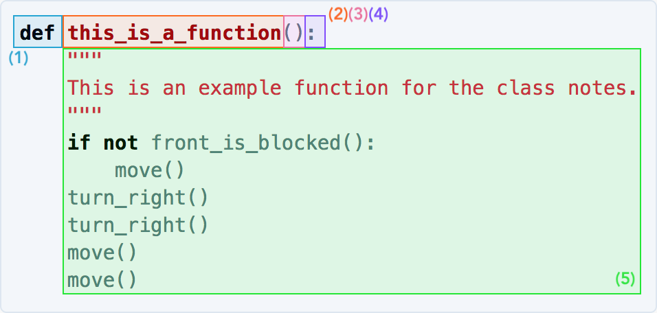

So far, you have learned about PyBot and have probably come across the word "function" more than a couple of times. But, what is a function?

> **Function** – Code that is grouped together and packaged under a name, so it can be called in one line.

Functions are the foundation of computer programming. Not only do they make it easier to read code, but they also allow us to write code that we can be reused over and over. Well-written functions are the mark of an engineer with good **style**.

> **Style** - The way a body of code is written. This includes the names used for variables, the code decomposition, and the overall structure of the code.

A program with good style typically has descriptive names and short, readable functions. We will go more into this later.

<a class="anchor-offset" id="syntax-breakdown" href="#syntax-breakdown"></a>
### Syntax Breakdown

In order to understand the way functions work, we are going to break them down to their simplest components. Let's use a PyBot function as an example:

```python
def this_is_a_function():
    """
    This is an example function for the class notes.
    """
    if not front_is_blocked():
        move()
    turn_right()
    turn_right()
    move()
    move()
```
Functions are capable of doing many things, but here we will focus on the essential features of a function. We are going to break it down by parts.



There are five essential parts to a function.

1. The `def` **keyword**.
2. The function name.
3. Parentheses!
4. Colon.
5. The function body.

<div class="definition-section" markdown="1">

<span class="definition-title">Definition</span>
**Keyword** - A special word in Python used to make something specific happen.

</div>

A function in Python is always started with the word `def` (1). Following the word `def` is the name of the function, in this case `this_is_a_function` (2), a set of parentheses (we will talk about these later) (3), and a colon (4). Following the _function header_ (what we call parts 1-4 all together), is the **body** of the function (5). The body of the function consists of a comment, and of course, the code itself. Notice that the body of the function is indented; this lets the Python interpreter know that the code underneath the function belongs to this specific function and not something else.

These components are present in _every single_ function, so if you understand this much, you are in pretty good shape!

<a class="anchor-offset" id="calling-functions" href="#calling-functions"></a>
### Calling Functions

In this section we will discuss how functions are used. To **call** a function is to use a function.

> **Call** – To execute the code within a function. If one were to say "I called a function" it would mean that he/she used the function in a program to execute the code within.

Functions can call other functions. In fact, this is the way that most functions are used. You have in fact, already called several functions! Each of the PyBot commands are functions. Knowing this, check out the following example of functions using PyBot commands.

```python
def move_across():
    """
    A function that allows PyBot to move across the whole board.
    """
    move()
    move()
    move()
    move()

def main():
    move_across()

if __name__ == "__main__":
    main()
``` 

Note: when calling a function, you must **always** put the parentheses after the function name. There are no exceptions!

We would say that the body of `main()` _calls_ `move_across()`. We would also say that the body of `move_across()` _calls_ the function `move()` four times. 

<div class="aside" markdown="1">

Wondering about the funky statement below the `main()` function? That is just code that gets the program to run. Do not worry about it for now; we will explain it later. For now, just know that that statement calls `main()`. In this class, it will always call `main()`, so you can think of `main()` as the starting point of all projects and exercises.

</div>

Here, we see an example of the usefulness of functions. Now, a programmer can get PyBot across the field with one, descriptive function call, instead of calling `move()` four times. Let's move on to _writing_ some functions that we want to call.

<a class="anchor-offset" id="function-implementation" href="#function-implementation"></a>
### Function Implementation

In this section we are going to do a brief exercise in **implementing** functions.

> **Implement** – To ~write~ code! This is a technical word often used in computer science. We use this word because the word for a specific instance of written code is called an **implementation**. (There are many words like this that may require a bit of explanation. If you ever come across a word that is being used in a funny way, please do not hesitate to ask!)

Writing a function is not so difficult. For now, it is the simple act of coming up with a function name and writing the function body. Let's try implementing a function in the exercise below.

<iframe frameborder="0" width="100%" height="600px" src="https://repl.it/student_embed/assignment/1314054/fa91cdc1980f08650bb8c261abbae01d"></iframe>

Congratulations on writing your first function! 

<a class="anchor-offset" id="decomposition" href="#decomposition"></a>
### Decomposition

In the above exercise, we put the three `turn_right()` functions into `turn_left()` so that we could use them without writing them out all the way every single time. This style technique is called **decomposition** and is foundational to being a good computer programmer. It keeps small programs readable, and large programs from spiraling out of control. 

Here is a good example of this. The following is a gif of a PyBot capable of collecting fruit on the south and east sides of the field:


Here are two implementations for the above gif. One with bad decomposition...

```python
def main():
    pick_fruit()
    move()
    pick_fruit()
    move()
    pick_fruit()
    move()
    pick_fruit()
    move()
    turn_right()
    turn_right()
    turn_right()
    pick_fruit()
    move()
    pick_fruit()
    move()
    pick_fruit()
    move()
    pick_fruit()
    move()
    turn_right()
    turn_right()
    turn_right()

if __name__ == '__main__':
    main()
```

... and one with good decomposition.

```python
def turn_left():
    turn_right()
    turn_right()
    turn_right()

def pick_and_move():
    pick_fruit()
    move()

def pick_fruit_across():
    pick_and_move()
    pick_and_move()
    pick_and_move()
    pick_and_move()

def main():
    pick_fruit_across()
    turn_left()
    pick_fruit_across()
    turn_left()

if __name__ == '__main__':
    main()
```

See the difference? Not only is the second code block shorter, it is also much easier to read.

Always strive to decompose your code into readable chunks. If you can do everything that we have explained so far, you are well on your way to becoming an excellent computer programmer!

