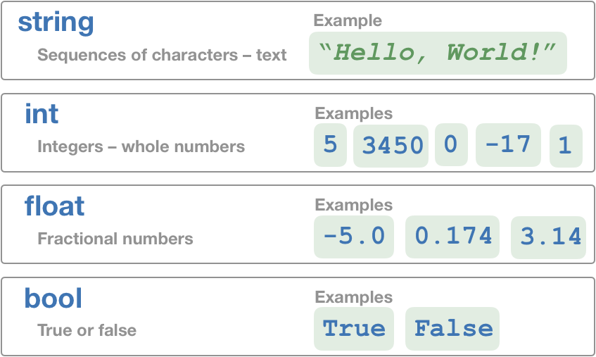

<a class="anchor-offset" id="introduction-to-objects-and-variables" href="#introduction-to-objects-and-variables"></a>
# Objects
We've been instructing PyBot to move around using `move()`, to collect oranges with `pick_fruit()` and change directions with `turn_right()`. These instructions (`move()`, `pick_fruit()` and `turn_right()`) are called **functions**, and we've even combined them together to create new **functions** like `safe_pick()`and `turn_left()`. Functions are like the **verbs** of computer programming – each function tells the computer to take an action. If functions are the verbs of programs, **objects** are the **nouns**.


Computer programs give us access to all sorts information stored inside the computer. Each piece of information is an **object**. A message on WhatsApp is an object, it is a piece of information stored in the computer. Every song on Spotify is an object, as are all the photos on Instagram.  In a word, objects are the "things" of computer programming. 
<div class="definition-section" markdown="1">

<span class="definition-title">Definition</span>
**Object** - A piece of information stored in the memory of the computer.
</div>

You've actually already used objects in your code! Consider the first Python program that we wrote:
```python
print("Hello, World!")
```
Here, the simple message `"Hello, World!"` is an object. 


## Object Classes
In the physical world, every object has a type. I'm sitting on an object of type "chair" and writing these notes on an object of type "computer". Similarly, every object inside the computer has a type – for example, song, image, and number are all types of objects in the computy. An object's **class** is it's type. 

<div class="definition-section" markdown="1">

<span class="definition-title">Definition</span>
**Class** - A type of object
</div>

### Four Basic Classes
In the physical world, there are 118 elemental classes, the elements of the periodic table! From these elements are built all other objects. There is a similar thing going on in computer programming except, thankfully, there are only four basic object classes: `string`, `int`, `float`, `bool`.



# Variables
<div class="definition-section" markdown="1">

<span class="definition-title">Definition</span>
**Variable** - A label for an object. The object associated with a variable can be changed by the programmer at any time.
</div>

Variables can be associated with objects holding information about populations...

```python
number_of_curitibanos = 1765000
```
... city names...

```python
city_name = "Rio de Janeiro"
```
... other variables...

```python
a_squared = a * a
b_squared = b * b
c_squared = a_squared + b_squared
```
... and even values that include itself!
```python
count = 0
count = count + 1 # Here, count will update to equal 1.
```

Variables are related, but different than the ones you may have seen in _Opreções_. Here, you (or the computer) will be **assigning** variables their objects. This allows the computer to as information for use later on.

<div class="definition-section" markdown="1">

<span class="definition-title">Definition</span>
**Assign** - To give a variable a value.

</div>

Creating variables and assigning them objects are easy. We simply use what is called an **assignment operator** to put together a variable name and its object, like so:

```python
name = 'Geoffrey'
```

Above, the word `name` becomes a variable, whose value is assigned to the string of letters `"Geoffrey"`. Here is another simple example of variables in action:

```python
iphone_memory_used = 67.5
iphone_memory_free = 60.5

iphone_memory_total = iphone_memory_used + iphone_memory_free
```

Here, we _assigned_ `iphone_memory_used` to 67.5, `iphone_memory_free` to 60.5, and `iphone_memory_total` to the sum of these two objects.

Remember, objects can be almost anything. In a rocket, it can be the altitude, the temperature, or its angle relative to Earth. In your phone, it could be your apps, your photos, or your contact list. Anytime a computer stores _any_ information, it is using objects.

### The Basics

There are four basic **classes** of objects: `integer` (or `int`), `float`, `string`, and `bool`.

<div class="definition-section" markdown="1">

<span class="definition-title">Definition</span>
**Class** - A type. Think of the class of a variable as its species. Each class has its own unique properties that define the way all things in the class behave.

</div>

Each of these classes define the behavior of objects when interacting with the rest of the program. Let's go through each one of these variable classes and learn some more about what we can do.

<a class="anchor-offset" id="integers" href="#integers"></a>
### Integers

<div class="definition-section" markdown="1">

<span class="definition-title">Definition</span>
**Integer** - A whole number.

</div>

Integers, or "ints," are quite simple. You can do most simple mathematical operations with Integers and keep track of things like the number of times you have done something, distance, or quantity.

```python
count = 0
```

<a class="anchor-offset" id="floats" href="#floats"></a>
### Floats

<div class="definition-section" markdown="1">

<span class="definition-title">Definition</span>
**Float** - A number that can have decimal values.

</div>

Floats are like Super-Integers. They can have decimal values, which means that they are much better to use in mathematical calculations than floats. They are typically used to hold scientific quantities like temperature, precise measurements, or other mathematical values.

```python
degrees_fahrenheit = 98.6
```

### Strings

<div class="definition-section" markdown="1">

<span class="definition-title">Definition</span>
**String** - A "string" of characters. It can consist of letters, numbers, or most other symbols.

</div>

 Use strings whenever you want to store text information in a variable. Because of this, strings are almost never used in math; however, there are many other tasks for which strings are useful.

```python
cs106r_sentence = 'CS106R is awesome!'
email_domain = '@gmail.com'
jersey_number = '9'
```

Here, `cs106r_sentence`, `email_domain`, and `jersey_number` are all examples of strings. Notice that we can store a number as a string.

<a class="anchor-offset" id="bools" href="#bools"></a>
### Bools

<div class="definition-section" markdown="1">

<span class="definition-title">Definition</span>
**Boolean** - A statement that can be either `True`, or `False`.

</div>

You have seen bools before. Remember `has_fruit()` and `front_is_blocked()`? Those were both functions that were either `True` or `False` - bools!

Here is an example of a bool variable in action:

```python
is_girl = True
```

Bools are what make `if` statements and `while` loops work in the way that they do. 

Variables allow us to store bool values, so something that looks like this...

```python
if front_is_blocked() and has_fruit():
    pick_fruit()
```

... is the exact same thing as this:

```python
corner_fruit = front_is_blocked() and has_fruit()

if corner_fruit:
    pick_fruit()
```

<div class="example-section" markdown="1">

<span class="example-title">Example</span>
A word of warning, however; be careful using bool variables when working with `if` statements and `while` loops. Let's take a look at a potential danger in the following example.

Let's imagine that we want to store the result of `not front_is_blocked` in a variable and we write the following:

```python
current_front_clear = not front_is_blocked()
while current_front_clear:
    move()
```

This will cause PyBot to crash at the end of the field. Why? 

The value of `front_is_blocked` is stored once at the _beginning_ of the program. The variable holds the information that it had before the `while` loop was executed and does not get a chance to update again (because we enter the `while` loop after the variable is created).

</div>

<div class="aside" markdown="1">

Now that you have learned about both bools and strings, you may be wondering to yourself:

> Why not just use strings that say "True" or "False" instead?

Bools are little guys that can only express two possibilities. Strings can store almost anything. Therefore, bools take up much less space in the computer. Instead of storing a string of characters, the computer actually stores a 0 for a False value, and a 1 for a True value.

</div>

With bools and the other variable classes in mind, you can begin to write programs capable of making decisions based on both present and past information. In the next section, we will go over how variables interact with each other.